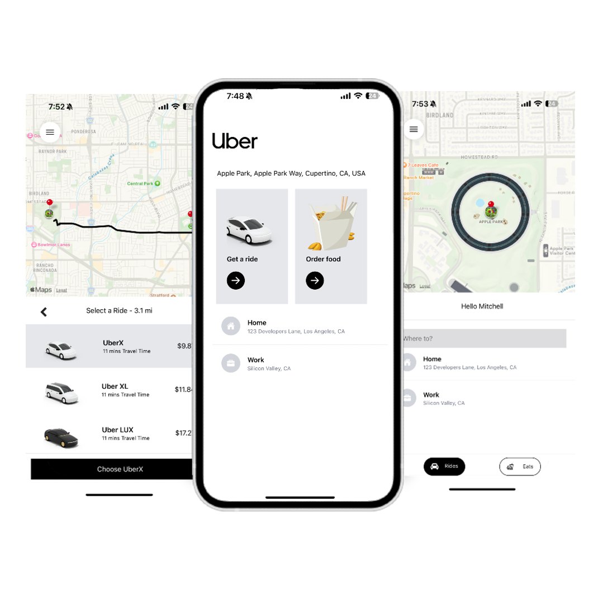

# Uber Clone 🚗

Uber Clone is a simulation of a ride-hailing app built with React Native, Tailwind CSS, Google Maps API, and Redux. Instead of booking real rides, you can search for any address and watch “fake” Ubers appear nearby on the map for a playful demo.

## 📱 Key Features

- **Location Search**  
  Autocomplete-powered search bar to find pickup and drop-off addresses.  
- **Interactive Map**  
  Google Maps integration to display chosen locations and scattered demo drivers.    
- **Redux State Management**  
  Centralized store for search queries, map center, and driver positions.  
- **Utility-First Styling**  
  Tailwind CSS for rapid UI development and consistent design.

## 🔧 Tech Stack

- React Native for cross-platform mobile development  
- Tailwind CSS for styling components  
- Google Maps API for maps, geocoding, and place autocomplete  
- Redux for global application state management  

## 🚀 Usage

1. Launch the app and grant location permissions.  
2. Type any address into the search bar.  
3. Select a suggestion to center the map.  
4. Watch simulated drivers (“fake” Ubers) appear around your location.  

## 📈 Future Enhancements

- Real ride-booking integration with a backend service  
- Driver ETA and dynamic ride estimates  
- User authentication and profile management  
- In-app chat between rider and driver  
- Push notifications for ride status updates  

---

Enjoy exploring the Uber Clone demo! Feel free to drop feedback or suggestions. 🎉
